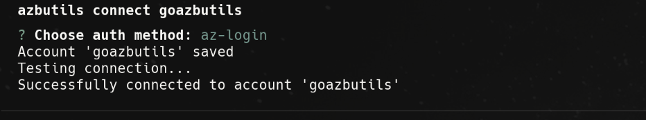
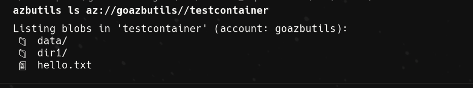
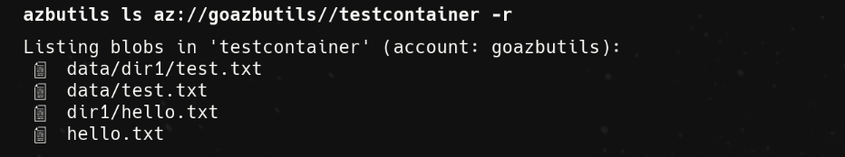
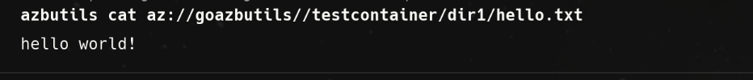
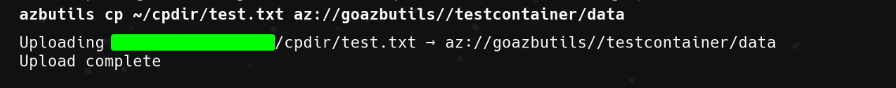
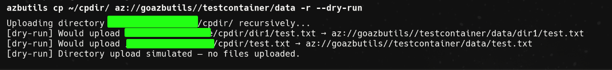

# go-azbutils

[](https://go.dev)
[](LICENSE)
[](https://github.com/orionnectar/go-azbutils/releases)
[](https://goreportcard.com/report/github.com/orionnectar/go-azbutils)

> A minimal Go CLI utility to connect and manage **Azure Blob Storage** using multiple authentication methods.  
> Designed for simplicity, security, and flexibility.

---

## Features

- Supports **Azure CLI**, **Connection String**, **Shared Key**, and **SAS URL**
- Seamless multi-account management via local config
- Secure: credentials stored in environment vars, not config files
- Compatible with all Azure Blob endpoints
- Cross-platform (Linux, macOS, Windows)

---

## Installation

### Using Homebrew (recommended)

```bash
brew install orionnectar/tools/azbutils
````

### Using Go

```bash
go install github.com/orionnectar/go-azbutils@latest
```

### From Source

```bash
git clone https://github.com/orionnectar/go-azbutils.git
cd go-azbutils
go build -o go-azbutils .
```

---

## Authentication Methods

| Method                | Description                             | Environment Variable Example   |
| --------------------- | --------------------------------------- | ------------------------------ |
| **az-login**          | Uses Azure CLI credentials (`az login`) | —                              |
| **connection-string** | Full Azure Storage connection string    | `GOAZBUTILS_CONNECTION_STRING` |
| **shared-key**        | Account name and access key             | `GOAZBUTILS_ACCOUNT_KEY`       |
| **sas**               | Shared Access Signature URL             | `GOAZBUTILS_SAS_URL`           |

> 💡 Replace `GOAZBUTILS` with your account name in uppercase (e.g., `MYACCOUNT_CONNECTION_STRING`).

---

## Usage

### Connect to an Account

```bash
azbutils connect <account-name>
```


You’ll be prompted to select an authentication method.

If using **Shared Key**:

```bash
export GOAZBUTILS_ACCOUNT_KEY="<your-key>"
```

If using **Connection String**:

```bash
export GOAZBUTILS_CONNECTION_STRING="DefaultEndpointsProtocol=https;AccountName=goazbutils;AccountKey=..."
```

If using **SAS URL**:

```bash
export GOAZBUTILS_SAS_URL="https://goazbutils.blob.core.windows.net/?sv=..."
```

---

### Verify Connection

```bash
azbutils connect goazbutils
```


---

### List Containers or Blobs

List blobs inside a container:

```bash
azbutils ls az://goazbutils//testcontainer
```



Recursive listing:

```bash
azbutils ls az://goazbutils//testcontainer -r
```



---
### Cat Blobs

Cat blobs:

```bash
azbutils cat az://goazbutils//testcontainer/hello.txt
```




### Copy Blobs

Copy blob:

```bash
azbutils cp az://goazbutils//
```



Recursive Copy:

```bash
azbutils cp az://goazbutils//testcontainer -r
```



---


### Reset Account Metadata

```bash
azbutils connect <account-name> --reset
```

This clears and reconfigures account metadata (auth method, etc.)
*Credentials are never stored - only metadata.*

---

## Configuration

Stored at:

```
~/.config/azbutils/config.json
```

Example:

```json
{
  "accounts": [
    {
      "account_name": "goazbutils",
      "auth_method": "shared-key"
    }
  ]
}
```

---

## Example Environment Setup

```bash
export GOAZBUTILS_CONNECTION_STRING="DefaultEndpointsProtocol=https;AccountName=goazbutils;AccountKey=..."
export GOAZBUTILS_ACCOUNT_KEY="abc123xyz"
export GOAZBUTILS_SAS_URL="https://goazbutils.blob.core.windows.net/?sv=..."
```
---

## Troubleshooting

| Issue                          | Possible Cause           | Solution                           |
| ------------------------------ | ------------------------ | ---------------------------------- |
| `missing environment variable` | Env var not exported     | Run `export ACCOUNTNAME_<KEY>`     |
| `connection string malformed`  | Typo in string           | Double-check syntax                |
| `failed to create client`      | Missing account metadata | Reconnect or reset using `--reset` |

---

## Learn More

* [Azure Blob Storage Docs](https://learn.microsoft.com/en-us/azure/storage/blobs/)
* [Azure SAS Tokens](https://learn.microsoft.com/en-us/azure/storage/common/storage-sas-overview)
* [Azure Storage Keys](https://learn.microsoft.com/en-us/azure/storage/common/storage-account-keys-manage)

---

## Author

**[orionnectar](https://github.com/orionnectar)**
Crafted with 💙 in Go.

---

## License

MIT License © [orionnectar](https://github.com/orionnectar)

---


